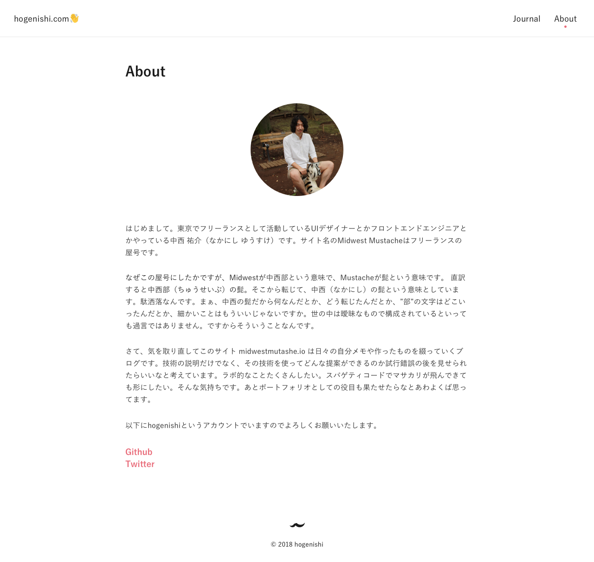
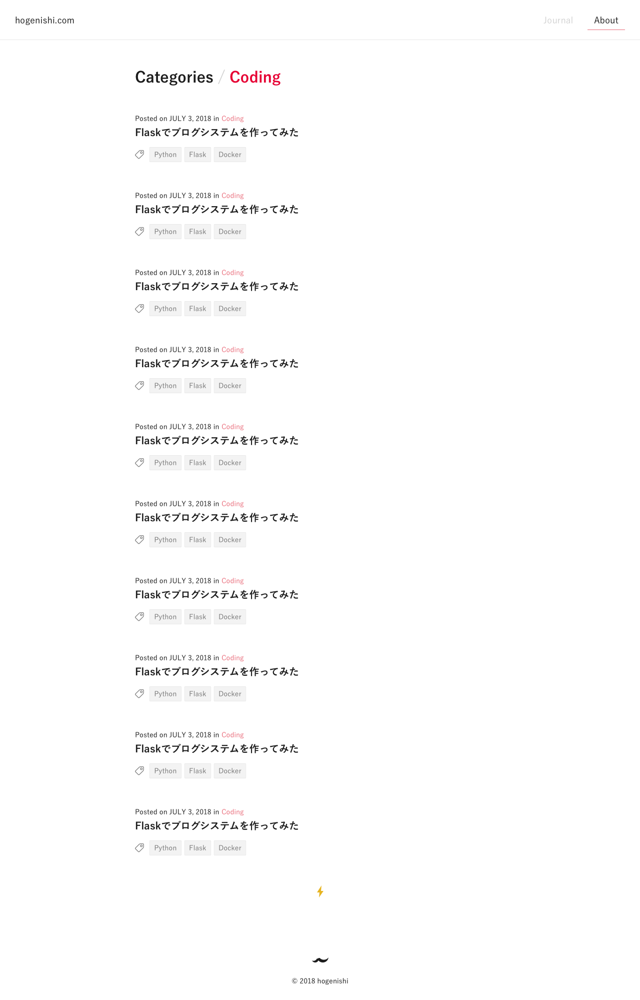
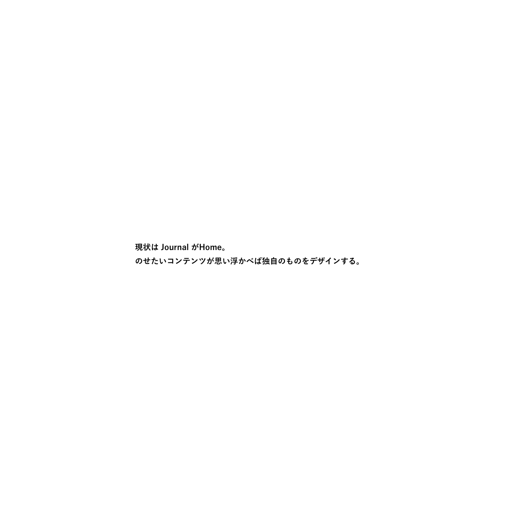
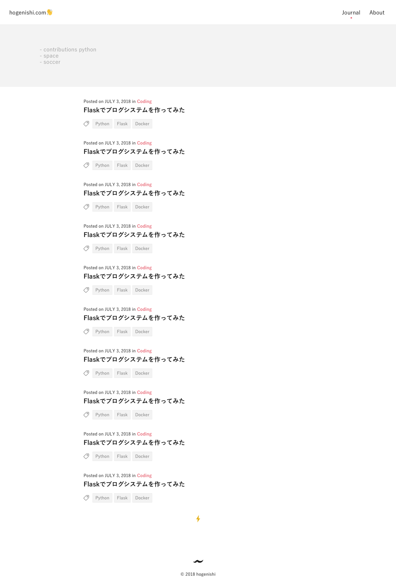
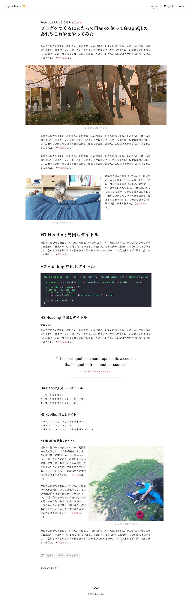
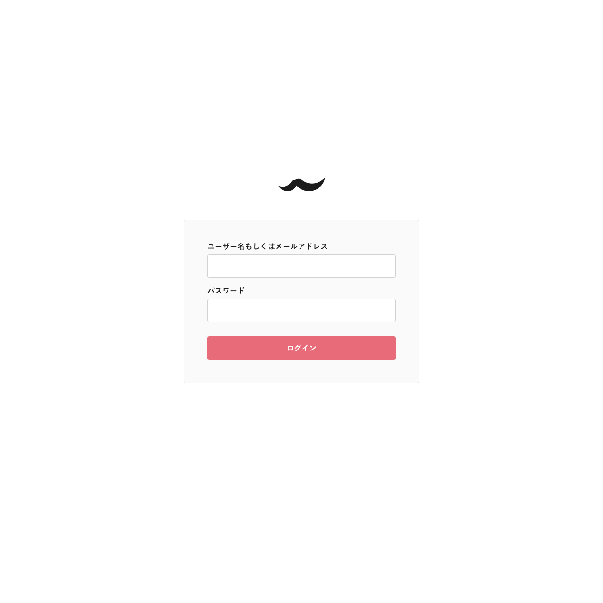

# Artboards

This is an autogenerated file showing all the artboards. Do not edit it directly.

## Colors 

## about

## admin_home

## analytics

## archive

## edit

## empty

## entry_item

## entry_item_date

## entry_item_title

## error

## footer

## header

## home

## item 

## item

## journal

## journal_entry

## label

## login

## projects

## search

